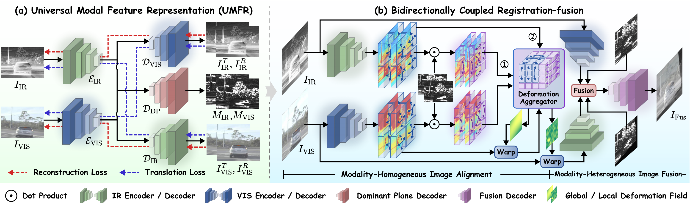

# Universal Representation for Real-world Misaligned Infrared-Visible Image Fusion

Jinyuan Liu, Zengxi Zhang, Jiahao Zhang, Zhiying Jiang, Long Ma, Xin Fan, Risheng Liu* ,**“Universal Representation for Real-world Misaligned Infrared-Visible Image Fusion”**, under review, 2025. 

## Overview

## Updates

[2025-09-05] The proposed RIVIR dataset is available
[2025-09-07] The testing code for RIVIR is available

## Download

Download the pre-trained model and put it in snapshot
  - [Google Drive](https://drive.google.com/drive/folders/1dXiR6XMNmEcMQ-7jBU8ZBFCXlABA6b30?usp=sharing)
  - [Baidu Yun](https://pan.baidu.com/s/12oKku8Hjpx-byz9ZCXvbAw?pwd=9ean)


## Requirements

```
Pytorch==1.12.1
```

## Test

```
python test_rivir.py
```

## Dataset (RIVIR dataset)
  - [Google Drive](https://drive.google.com/drive/folders/1elN000V9ij90-n8t9j5i4y065T376wBr?usp=drive_link)
